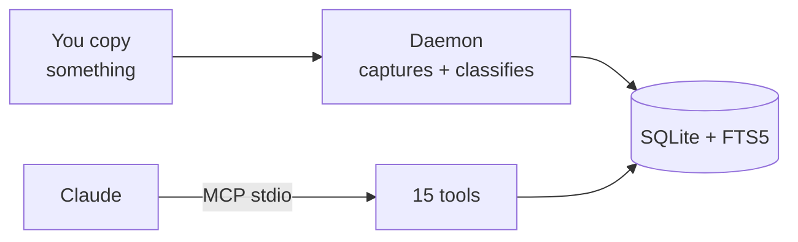

# clipboard-history-mcp

Type-aware, secret-safe macOS clipboard history exposed to Claude via MCP.



## Why

- **Maccy** is great as a clipboard manager but doesn't talk to LLMs.
- The other ~20 `clipboard-mcp` repos on GitHub only read the *current* clipboard — no history.
- `vlad-ds/maccy-clipboard-mcp` reads Maccy's DB but is tied to Maccy.

This project does three things none of the above do **together**:

1. **Type-aware retrieval.** Every clip is classified at capture (`url`, `json`, `code:python`, `sql`, `secret:openai_api_key`, …) and exposed via filtered tools.
2. **Secret-aware capture.** API keys, JWTs, AWS access keys, credit cards (252 patterns from gitleaks) are detected, encrypted at rest (AES-256-GCM, key in macOS Keychain), and never leak to Claude unless you call `unlock_secret(id, reason)`.
3. **Always-on background daemon** under launchd. History is captured even when Claude Code is closed.

## Comparison

|  | Maccy | maccy-clipboard-mcp | clipboard-history-mcp |
|---|---|---|---|
| Captures clipboard | ✓ | (reads Maccy's DB) | ✓ |
| Indexes window titles | ✗ | ✗ | ✓ |
| Type-aware tools (URL/code/SQL/JSON) | ✗ | ✗ | ✓ |
| Secret detection + encryption | ✗ | ✗ | ✓ |
| Standalone (no other app required) | n/a | ✗ | ✓ |
| GUI / hotkey | ✓ | ✗ | ✗ (use Maccy alongside) |

## Install

```bash
git clone https://github.com/d-khomenko/clipboard-history-mcp
cd clipboard-history-mcp
npm install
bash scripts/build-native.sh
node bin/clipboard-history install
claude mcp add -s user clipboard-history -- node "$(pwd)/src/mcp/index.js"
```

Restart Claude Code, then ask: *"List my recent clipboard URLs."*

## Configuration

| Var | Default | Purpose |
|---|---|---|
| `CLIPBOARD_POLL_MS` | `1500` | watcher poll interval |
| `CLIPBOARD_HISTORY_MAX` | `1000` | ring-buffer size |
| `CLIPBOARD_CAPTURE_WINDOW_TITLE` | `0` | opt-in to window title capture (needs Accessibility) |
| `CLIPBOARD_IGNORE_APPS` | (empty) | comma list of app display names to skip |
| `CLIPBOARD_NEVER_STORE_SECRETS` | `0` | paranoid mode — secret metadata only, no ciphertext |

## Tools

`list_history`, `get_item`, `search_history`, `get_urls`, `get_code(language?)`, `get_json`, `get_secrets_index`, `unlock_secret(id, reason)`, `copy_item`, `pin_item`, `tag_item`, `delete_item`, `clear_history`, `get_stats`, `daemon_status`.

See [`docs/superpowers/specs/2026-05-05-clipboard-history-mcp-v2-design.md`](docs/superpowers/specs/2026-05-05-clipboard-history-mcp-v2-design.md) for design details.

## License

MIT.

`vendor/gitleaks.toml` is the gitleaks rule catalog (MIT) — see `vendor/README.md`.
