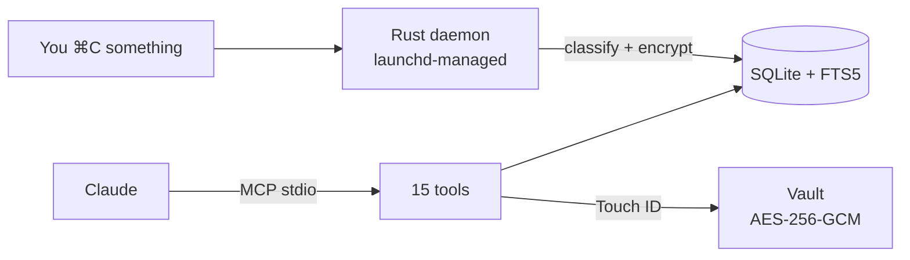
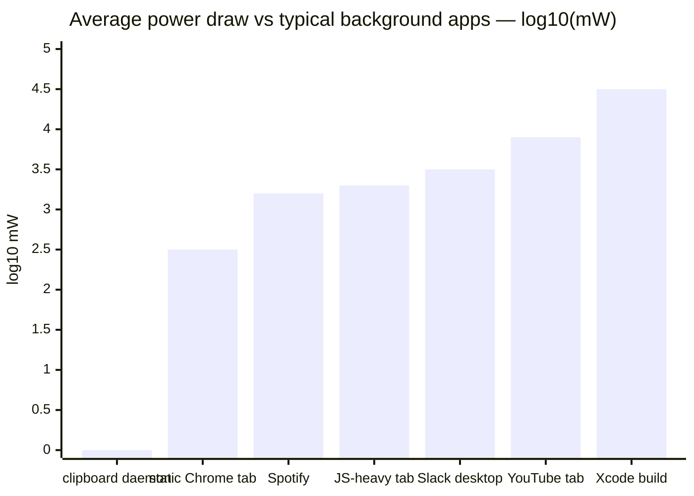

# clipboard-history-mcp

> Your clipboard, but Claude can read it. Type-classified, secret-encrypted, macOS-native.



**One Rust binary.** No Node.js, no Swift toolchain, no other apps to install. Drag a `.mcpb` into Claude Desktop, done.


---

## What this gets you

You're working in Claude. You've copied **47 things today** — URLs, JSON snippets, an OpenAI key from a dashboard, a SQL query from your DB tool, half a Stripe webhook payload. Now Claude can use any of them:

```
You: "Find that API key I copied from the OpenAI dashboard yesterday"
Claude: Found 1 secret matching "OpenAI" — kind: openai_api_key,
source: Safari, copied 14h ago. Last 4 chars: ab12.
To reveal, call unlock_secret(id=23, reason="...").

You: "Give me all the GitHub URLs I copied"
Claude: Returns 12 unique GitHub URLs deduplicated by repo,
ranked by how often you pasted them back.

You: "There was a Stripe JSON config in the buffer — restore it to my clipboard"
Claude: Found, restoring. ✓ ready to ⌘V.

You: "What code did I copy from ChatGPT over the last 2 hours?"
Claude: 3 Python snippets, 1 SQL query, 1 shell command.
```

Search uses SQLite **FTS5** + window-title indexing — you find clips by *where* you copied them, not just by content.

---

## Why nothing else does this

| | [Maccy](https://maccy.app) | [maccy-clipboard-mcp](https://github.com/vlad-ds/maccy-clipboard-mcp) | clipboard-history-mcp |
|---|---|---|---|
| Captures clipboard | ✓ | (reads Maccy's DB) | ✓ |
| Classifies clip type (URL/JSON/code/SQL/secret) | ✗ | ✗ | ✓ |
| Indexes window titles for context-search | ✗ | ✗ | ✓ |
| Detects secrets at capture (252 gitleaks rules) | ✗ | ✗ | ✓ |
| Encrypts secrets at rest with Touch ID gate | ✗ | ✗ | ✓ |
| Standalone binary (no runtime needed) | n/a | ✗ | ✓ macOS + Linux |
| `.mcpb` one-click install | n/a | ✗ | ✓ |

The other ~20 `clipboard-mcp` repos on GitHub only read the *current* clipboard. None capture history.

---

## Install

### One-click — Claude Desktop

1. Download `clipboard-history-mcp.mcpb` from the [latest release](https://github.com/d-khomenko/clipboard-history-mcp/releases/latest).
2. Claude Desktop → Settings → Extensions → "Install from file" → pick the `.mcpb`.
3. Restart Claude Desktop. Ask: *"List my recent clipboard URLs."*

### Manual — Claude Code / CLI

```bash
curl -L https://github.com/d-khomenko/clipboard-history-mcp/releases/latest/download/clipboard-history-mcp.mcpb \
  -o clipboard-history-mcp.mcpb
unzip clipboard-history-mcp.mcpb -d ext

# register MCP
claude mcp add -s user clipboard-history -- ./ext/server/clipboard-history-mcp serve

# install background daemon (captures even when Claude is closed)
./ext/server/clipboard-history-mcp install
```

### From source (macOS)

Requirements: Rust 1.95+, macOS 13+.

```bash
git clone https://github.com/d-khomenko/clipboard-history-mcp
cd clipboard-history-mcp
cargo build --release
./target/release/clipboard-history-mcp install                                 # start daemon
claude mcp add -s user clipboard-history -- "$(pwd)/target/release/clipboard-history-mcp" serve
```

### Linux (X11; Wayland partial)

Requirements: a working Secret Service implementation (GNOME Keyring or KWallet — comes with most desktop installs), `xvfb` not required for normal use (only for headless CI).

```bash
git clone https://github.com/d-khomenko/clipboard-history-mcp
cd clipboard-history-mcp
cargo build --release

# Set a master password (used to wrap your AES master key)
./target/release/clipboard-history-mcp migrate-v2

# Install systemd user service
./target/release/clipboard-history-mcp install
# Optional: keep daemon running after logout
./target/release/clipboard-history-mcp install --linger

# Register with Claude Code
claude mcp add -s user clipboard-history -- "$(pwd)/target/release/clipboard-history-mcp" serve
```

**Wayland note:** clipboard read/write works on Wayland via `arboard`'s portal handling. Window-title capture (opt-in via `CLIPBOARD_CAPTURE_WINDOW_TITLE=1`) currently only works on X11; Wayland support is deferred to v0.4.x once `xdg-desktop-portal` window-title APIs are widely shipped.

**1Password / Bitwarden:** add app names to `CLIPBOARD_IGNORE_APPS` so password-manager paste events are skipped:

```bash
CLIPBOARD_IGNORE_APPS="1Password,Bitwarden,KeePassXC" \
  ./target/release/clipboard-history-mcp install
```

### Auto-mirror to Obsidian vault (optional)

If you also use Obsidian, the daemon can write a sidecar `.md` for every captured clip plus a daily-note timeline entry. Configure at install time:

```bash
clipboard-history-mcp install --vault ~/Documents/Obsidian/MyVault
```

Result: every non-secret clip lands as `<vault>/clipboard/YYYY-MM/<id>-<kind>-<slug>.md` with frontmatter (kind, source, captured-at), and a bullet appended to `<vault>/daily/YYYY-MM-DD.md` linking back to the sidecar. Secrets are **never** mirrored — they stay encrypted in the SQLite vault.

The daemon owns the `## Clipboard captures` H2 section in your daily notes — append-only, idempotent. You can write anything else above or below it.

---

## Try asking Claude

Copy any of these prompts into Claude after install:

```
List my last 20 clipboard entries.

Show me only the URLs I've copied today.

Search my clipboard history for "anthropic".

Find any code snippets in Python from the last 3 hours.

How many secrets are in my clipboard vault, by kind?

Pin the JSON I just copied — I'll need it again.

What apps did I copy from most this week?

Restore that GitHub PR link to my clipboard.
```

Claude picks the right tool from 15 available and answers directly.

---

## Configuration

Set env vars in the launchd plist (`install` writes them) or via `claude mcp add --env KEY=val`:

| Variable | Default | What it does |
|---|---|---|
| `CLIPBOARD_POLL_MS` | `1500` | Watcher poll interval (ms) |
| `CLIPBOARD_HISTORY_MAX` | `1000` | Ring-buffer size |
| `CLIPBOARD_CAPTURE_WINDOW_TITLE` | `0` | Capture window titles (needs Accessibility permission) |
| `CLIPBOARD_IGNORE_APPS` | *(empty)* | Comma-separated app display names to skip |
| `CLIPBOARD_NEVER_STORE_SECRETS` | `0` | Paranoid mode — metadata only, no ciphertext |
| `CLIPBOARD_DATA_DIR` | `~/Library/Application Support/clipboard-history-mcp` | Override data dir |
| `CLIPBOARD_VAULT_PATH` | *(empty)* | Auto-mirror non-secret clips to this Obsidian vault directory (sidecar `.md` per clip + bullet in `daily/YYYY-MM-DD.md`). Set via `--vault PATH` at install time. |

---

## Tools (15)

### Read

| | |
|---|---|
| `list_history(limit?, kind?, source_app?, since?, pinned_only?)` | Paginated history, newest first |
| `get_item(id)` | Single clip by id |
| `search_history(query, limit?)` | FTS5 BM25 across preview + window title |
| `get_urls(limit?)` | URL clips, deduped by hostname |
| `get_code(language?, limit?)` | Code clips, optional language filter |
| `get_json(limit?)` | JSON clips with parsed structure |
| `get_secrets_index(kind?)` | Secret metadata — **no values** |
| `unlock_secret(id, reason)` | Decrypt one secret — **gated by Touch ID** |
| `get_stats` | Counts by kind, oldest/newest, db size |
| `daemon_status` | PID, running state |

### Write

| | |
|---|---|
| `copy_item(id)` | Restore a clip back to system clipboard |
| `pin_item(id, pinned)` | Pin so it survives `clear_history` |
| `tag_item(id, tag, remove?)` | Free-form tagging |
| `delete_item(id)` | Hard delete |
| `clear_history(scope)` | `'all' \| 'older_than_days:N' \| 'kind:K'` |

---

## CLI

```
clipboard-history-mcp daemon         # run watcher (managed by launchd)
clipboard-history-mcp serve          # MCP stdio server (Claude spawns this)
clipboard-history-mcp install [--window-titles]
clipboard-history-mcp uninstall [--keep-data]
clipboard-history-mcp status         # JSON: daemon pid, db size, etc.
clipboard-history-mcp vault list     # secret metadata
clipboard-history-mcp vault unlock N # decrypt secret #N (Touch ID)
clipboard-history-mcp doctor         # diagnose perms/Keychain/pasteboard
clipboard-history-mcp migrate-v2     # validate v0.2.x SQLite (no-op import)
```

---

## Security model

- **Secrets detected at capture** — 252+ gitleaks regex patterns + RFC 7519 JWT + Luhn-validated cards.
- **Encryption at rest** — AES-256-GCM with a 32-byte master key in macOS Keychain.
- **Touch ID gate** — `unlock_secret` calls `LAContext.evaluatePolicy(.deviceOwnerAuthenticationWithBiometrics)`. 5-minute auth cache per session.
- **LLM-blind by default** — `list_history` and `search_history` return secret rows with `text: null` and `preview: "[REDACTED:kind]"`. The only path that returns plaintext is `unlock_secret(id, reason)`, and the `reason` argument is mandatory and audit-logged.
- **Paranoid mode** — `CLIPBOARD_NEVER_STORE_SECRETS=1` keeps metadata only; ciphertext never written.
- **Transient-type respect** — clips marked by password managers (1Password, Bitwarden) with `org.nspasteboard.ConcealedType` are never captured.

---

## Architecture

```
src/
├── main.rs               # binary entry; clap subcommand dispatch
├── core/
│   ├── db.rs             # SQLite WAL + migrations + FTS5
│   ├── store.rs          # add/list/search/delete clips
│   ├── crypto.rs         # AES-256-GCM + Keychain
│   ├── types.rs          # classifier (url/json/sql/shell/code:lang)
│   ├── secrets.rs        # gitleaks rules + JWT + Luhn
│   ├── pasteboard.rs     # NSPasteboard via objc2
│   └── biometry.rs       # LAContext Touch ID gate
├── daemon/{watcher,context}.rs    # poll loop on pinned thread
├── mcp/tools.rs                   # 15 MCP tools via rmcp
└── cli/{install,uninstall,status,vault,doctor,migrate_v2}.rs
```

**Tech stack:** Rust 1.95 · `rmcp` 1.6 · `tokio` · `objc2` · `rusqlite` (bundled FTS5) · `aes-gcm` · `security-framework` · `objc2-local-authentication` · `clap` 4

---

## Performance

Daemon idle footprint, measured on Apple Silicon with default `CLIPBOARD_POLL_MS=1500` and vault-mirror enabled:

| Metric | Value | How measured |
|---|---|---|
| **CPU steady-state** | **0.05 %** | `ps` cumulative CPU-time delta over 60 s (0.03 s / 60 s) |
| **Memory (RSS)** | **~24 MB** | `ps -o rss` |
| **Power draw (avg)** | **~1 mW** | 0.05 % of an E-core (~1 W full tilt) running continuously |
| **Battery impact** | **~1 % per 3 weeks** | 1 mW × 504 h = 0.5 Wh on a 52 Wh MacBook Air battery, assuming 24/7 continuous run |

For context — every visible bar below is **at least 300× the daemon**, on a log-10 scale (each y-axis unit = 10× more power):



Reading: `0` = 1 mW (this daemon), `2` = 100 mW, `3` = 1 W, `4.5` = ~30 W. An Xcode build pulls **five orders of magnitude** more than the clipboard daemon; a single Slack tab pulls about three.

Burst cost on each `⌘C`: ~30 ms tick at 1–3 % CPU (secret-classifier regexes + FTS5 index + AES-GCM + optional vault file write), then back to idle. Activity Monitor's _Energy Impact_ column reports ~0 — below its detection threshold.

Linux numbers untested but expected similar order of magnitude (`arboard` polling + SQLite is portable).

---

## FAQ

**Does this run on Linux/Windows?**  
Not yet. Phase 2. The pasteboard layer is macOS-specific (`NSPasteboard`); cross-platform abstraction is on the roadmap.

**What if I copy a 50MB blob?**  
Currently captured. A `CLIPBOARD_MAX_BYTES` guard is on the v0.3.x roadmap.

**Can Claude leak my secrets?**  
Not without you (a) installing this tool, (b) approving Touch ID, (c) the LLM choosing to call `unlock_secret` with a `reason` that gets logged. The `text` field for secret rows is always `null` in `list_history`/`search_history`.

**Does it sync across Macs?**  
No. v0.3 is per-Mac. iCloud/Git E2E sync is Phase 2.

**Can I use this with Maccy already running?**  
Yes. They don't conflict — Maccy provides UI, this provides the MCP layer. Both poll `NSPasteboard.changeCount` independently.

**What about [other clipboard manager]?**  
Same answer — there's no exclusive lock. Worst case, both store the same clip; storage cost is trivial.

---

## Changelog

See [CHANGELOG.md](CHANGELOG.md). Latest: [v0.3.0-alpha.0](https://github.com/d-khomenko/clipboard-history-mcp/releases/tag/v0.3.0-alpha.0).

## Contributing

See [CONTRIBUTING.md](CONTRIBUTING.md). PRs welcome — issues with macOS 13/14 reproductions especially.

## Sponsor

Pre-1.0 alpha. Built solo, in bursts. If `clipboard-history-mcp` finds you a
leaked key, saves you from typing the same JSON twice, or just makes Claude
slightly more useful at your terminal — consider [becoming a backer or
Founding Sponsor on Patreon](https://www.patreon.com/c/DmytroKhomenko).

- **$3 / month — backer ☕** — name in [`SUPPORTERS.md`](./SUPPORTERS.md), Discord role
- **$10 / month — founding sponsor 🥇** — name + avatar in this README, **permanently** listed if you join before v1.0

Sponsorship is gratitude, not a support contract. It does not buy priority
issue triage, custom features, or response-time SLA — solo OSS doesn't scale
that way. What it buys: visibility, the occasional roadmap vote, and proof
that this kind of tool is worth maintaining past `0.x`.

GitHub Sponsors works too — see the **Sponsor** button at the top of the repo.

## License

MIT. `vendor/gitleaks.toml` is the gitleaks rule catalog (also MIT) — see `vendor/README.md`.
