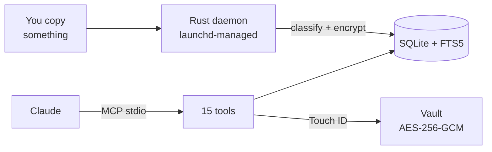

# clipboard-history-mcp

> **v0.3 — Rust rewrite.** Single self-contained binary, zero Node.js/npm runtime dependency, packaged as `.mcpb` for one-click install in Claude Desktop.

Type-aware, secret-safe macOS clipboard history exposed to Claude via MCP.



## Why

- **Maccy** is great as a clipboard manager but doesn't talk to LLMs.
- The other ~20 `clipboard-mcp` repos on GitHub only read the *current* clipboard — no history.
- `vlad-ds/maccy-clipboard-mcp` reads Maccy's DB but is tied to Maccy.

This project does three things none of the above do **together**:

1. **Type-aware retrieval.** Every clip is classified at capture (`url`, `json`, `code:python`, `sql`, `secret:openai_api_key`, …) and exposed via filtered tools.
2. **Secret-aware capture.** API keys, JWTs, AWS access keys, credit cards (252 patterns from gitleaks) are detected, encrypted at rest (AES-256-GCM, key in macOS Keychain), and never leak to Claude unless you call `unlock_secret(id, reason)` — which requires Touch ID.
3. **Always-on background daemon** under launchd. History is captured even when Claude Code is closed.

## Comparison

|  | Maccy | maccy-clipboard-mcp | clipboard-history-mcp v3 |
|---|---|---|---|
| Captures clipboard | ✓ | (reads Maccy's DB) | ✓ |
| Indexes window titles | ✗ | ✗ | ✓ (opt-in) |
| Type-aware tools (URL / code / SQL / JSON) | ✗ | ✗ | ✓ |
| Secret detection + Touch ID gate | ✗ | ✗ | ✓ |
| Standalone binary (no runtime needed) | n/a | ✗ | ✓ |
| GUI / hotkey | ✓ | ✗ | ✗ (use Maccy alongside) |
| Packaged as .mcpb | n/a | ✗ | ✓ |

## Quick install (Claude Desktop — .mcpb)

1. Download `clipboard-history-mcp.mcpb` from the [latest release](https://github.com/d-khomenko/clipboard-history-mcp/releases/latest).
2. Open Claude Desktop → Settings → Extensions → "Install from file".
3. Select the `.mcpb` file and confirm.

The extension registers the MCP server automatically. Restart Claude Desktop, then ask:

> *"List my recent clipboard URLs."*

## Manual install (Claude Code / CLI)

```bash
# Download the latest release binary
curl -L https://github.com/d-khomenko/clipboard-history-mcp/releases/latest/download/clipboard-history-mcp.mcpb \
  -o clipboard-history-mcp.mcpb

# Unpack (optional — to get the raw binary)
unzip clipboard-history-mcp.mcpb -d clipboard-history-mcp-ext

# Register with Claude Code
claude mcp add -s user clipboard-history -- \
  ./clipboard-history-mcp-ext/server/clipboard-history-mcp serve

# Install the launchd daemon (captures clipboard in background)
./clipboard-history-mcp-ext/server/clipboard-history-mcp install
```

## Build from source

Requirements: Rust 1.95+, macOS 13+.

```bash
git clone https://github.com/d-khomenko/clipboard-history-mcp
cd clipboard-history-mcp

# Build universal binary + pack .mcpb
bash scripts/pack-mcpb.sh

# Install daemon
./target/universal-apple-darwin/clipboard-history-mcp install

# Add to Claude Code
claude mcp add -s user clipboard-history -- \
  "$(pwd)/target/universal-apple-darwin/clipboard-history-mcp" serve
```

## Configuration

All options are environment variables (passed via the launchd plist or `claude mcp add --env`):

| Variable | Default | Purpose |
|---|---|---|
| `CLIPBOARD_POLL_MS` | `1500` | Watcher poll interval (ms) |
| `CLIPBOARD_HISTORY_MAX` | `1000` | Ring-buffer size |
| `CLIPBOARD_CAPTURE_WINDOW_TITLE` | `0` | Opt-in to window title capture (requires Accessibility permission) |
| `CLIPBOARD_IGNORE_APPS` | *(empty)* | Comma-separated list of app display names to skip |
| `CLIPBOARD_NEVER_STORE_SECRETS` | `0` | Paranoid mode — store metadata only, no ciphertext |
| `CLIPBOARD_DATA_DIR` | `~/Library/Application Support/clipboard-history-mcp` | Override data directory |
| `CLIPBOARD_DB_PATH` | `$CLIPBOARD_DATA_DIR/history.db` | Override database path |

## MCP Tools (15)

### Read
| Tool | Description |
|---|---|
| `list_history` | Paginated clipboard history (newest first) |
| `get_item(id)` | Single clip by ID |
| `search_history(q)` | Full-text search (SQLite FTS5) |
| `get_urls` | All URL clips |
| `get_code(language?)` | Code clips, optionally filtered by language |
| `get_json` | JSON clips |
| `get_secrets_index` | Encrypted-secret metadata (no plaintext) |
| `unlock_secret(id, reason)` | Decrypt a secret after Touch ID authentication |
| `get_stats` | DB stats: counts by type, DB size, oldest/newest |
| `daemon_status` | Daemon PID, uptime, last capture time |

### Write
| Tool | Description |
|---|---|
| `copy_item(id)` | Write a clip back to the clipboard |
| `pin_item(id)` | Pin/unpin a clip (excluded from `clear_history`) |
| `tag_item(id, tags)` | Set freeform tags on a clip |
| `delete_item(id)` | Permanently delete a clip |
| `clear_history` | Delete all unpinned clips |

## CLI subcommands

```
clipboard-history-mcp <subcommand>

Subcommands:
  daemon       Run the clipboard watcher (managed by launchd)
  serve        Start MCP stdio server (used by Claude Desktop / claude mcp)
  install      Write + load the launchd plist (daemon auto-starts on login)
  uninstall    Unload + remove plist (optionally keeps data with --keep-data)
  status       Print JSON: dataDir, dbPath, dbExists, dbSizeBytes, daemonPid
  vault list   List encrypted secrets (metadata only)
  vault unlock <id>  Decrypt a secret (prompts Touch ID)
  doctor       Diagnose common issues (permissions, DB health, plist status)
  migrate-v2   Validate/import v2 Node.js data (no-op if no v2 data found)
```

## Architecture

```
src/
├── main.rs               # binary entry; clap subcommand dispatch
├── lib.rs                # re-exports for integration tests
├── core/
│   ├── db.rs             # SQLite WAL + migrations + FTS5
│   ├── store.rs          # add/list/search/delete clips
│   ├── crypto.rs         # AES-256-GCM + Keychain biometric ACL
│   ├── types.rs          # clip classifier (url/json/sql/shell/code:lang)
│   ├── secrets.rs        # gitleaks rules + JWT + Luhn
│   ├── pasteboard.rs     # NSPasteboard via objc2
│   └── biometry.rs       # LAContext Touch ID gate
├── daemon/
│   ├── watcher.rs        # poll loop on pinned thread
│   └── context.rs        # frontmost app + window title
├── mcp/
│   └── tools.rs          # 15 MCP tools via rmcp
└── cli/
    ├── install.rs        # launchd plist write + load
    ├── uninstall.rs
    ├── status.rs
    ├── vault.rs
    ├── doctor.rs
    └── migrate_v2.rs
```

**Tech stack:** Rust 1.95 · rmcp 1.6 · tokio · objc2 · rusqlite (bundled FTS5) · aes-gcm · security-framework · clap 4

## Security model

- Secrets are **detected at capture** using 252+ gitleaks patterns, JWT structure detection, and Luhn-validated card numbers.
- Detected secrets are stored **AES-256-GCM encrypted**. The master key lives in the macOS Keychain with a biometric ACL — only Touch ID (or device passcode) can release it.
- `unlock_secret` is the only tool that ever decrypts. It calls `LAContext.evaluatePolicy` before returning plaintext.
- Set `CLIPBOARD_NEVER_STORE_SECRETS=1` to store secret metadata only (no ciphertext at all).

## Changelog

See [CHANGELOG.md](CHANGELOG.md).

## License

MIT.

`vendor/gitleaks.toml` is the gitleaks rule catalog (MIT) — see `vendor/README.md`.
