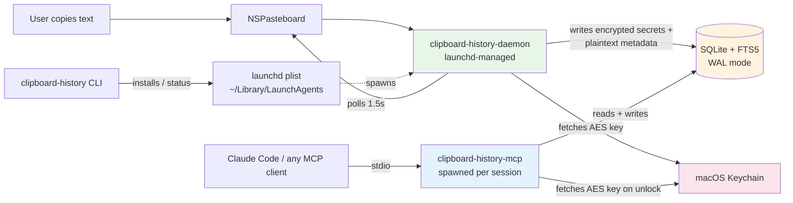
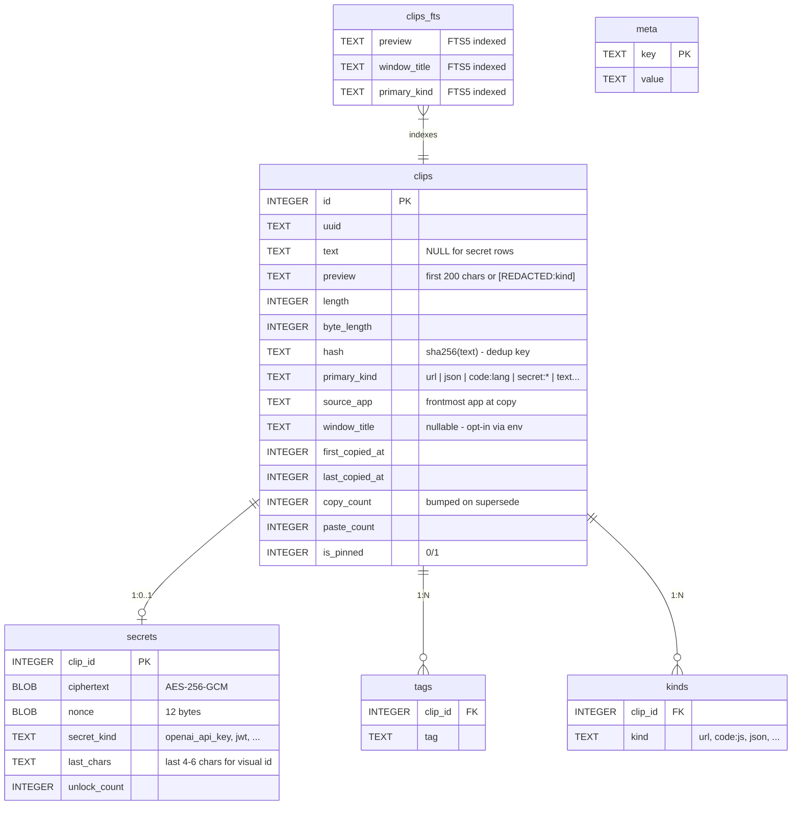
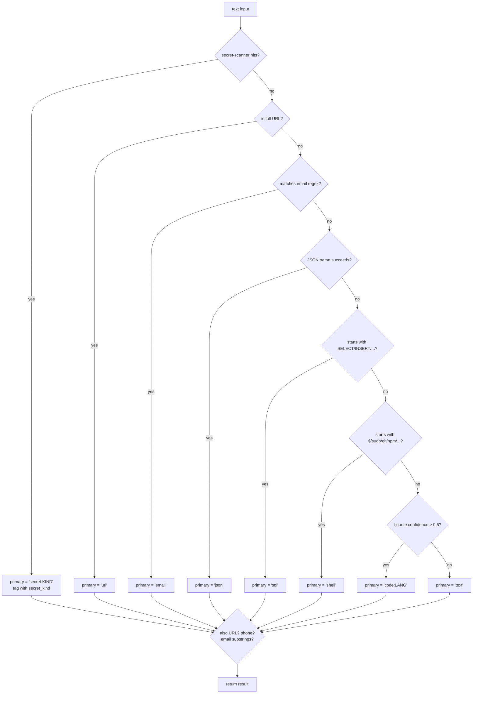
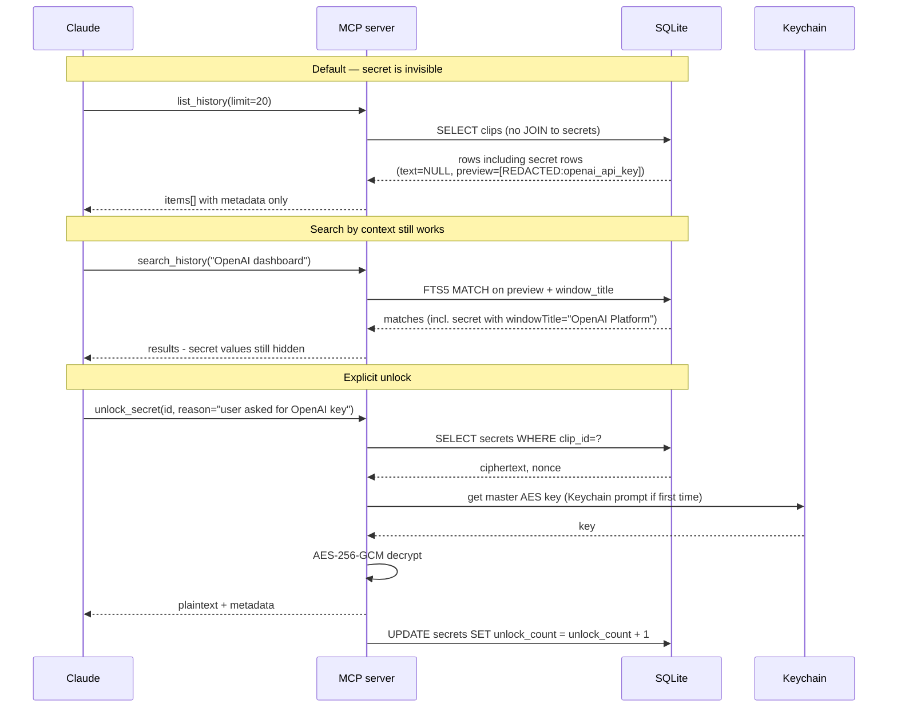

# clipboard-history-mcp v2 — design spec

**Status:** Draft
**Date:** 2026-05-05
**Author:** Dmytro Khomenko + Claude
**Topic:** Type-aware, secret-safe macOS clipboard history exposed to LLMs via MCP

---

## 1. Why this exists

There are ~20 "clipboard MCP" servers on GitHub. All but two just wrap
`pbpaste`/`pbcopy` for the *current* clipboard. The two history-aware
exceptions are:

- **`vlad-ds/maccy-clipboard-mcp`** — piggybacks on [Maccy](https://maccy.app)'s
  SQLite store. Tied to Maccy ($9.99 in App Store, free via brew/source).
- **`akougkas/smart-clipboard-mcp`** — Python, semantic tagging; small audience.

Plain Maccy + `maccy-clipboard-mcp` is already a decent stack. To justify a new
project we need a sharper proposition.

### What we do that nobody else does

1. **Type-aware retrieval.** Every clip is classified at capture (`url`, `json`,
   `code:python`, `sql`, `shell`, `secret:openai_api_key`, …). The MCP exposes
   filtered tools: `get_urls`, `get_code(language='go')`, `get_json`,
   `get_secrets_index`. Claude gets surgical access instead of a flat dump.

2. **Secret-aware capture with context indexing.** Secrets are detected at
   capture time using the gitleaks rule catalog (252 patterns), encrypted at
   rest (AES-256-GCM, key in macOS Keychain), and indexed by **source app +
   window title** in plaintext — so `search_history("OpenAI dashboard")` finds
   the API key by *where* you copied it, without revealing the value until you
   call `unlock_secret(id, reason)`.

3. **Always-on background daemon.** Watcher runs under launchd; history is
   captured even when Claude Code isn't open.

Maccy doesn't index window titles, doesn't classify content, and doesn't
expose anything to LLMs. The other MCPs don't capture history at all. We
combine all three into one cohesive tool.

---

## 2. Goals and non-goals

### Goals (Phase 1)

- macOS-only. Polled `pbpaste` watcher, configurable interval (default 1.5 s).
- SQLite + FTS5 storage at `~/Library/Application Support/clipboard-history-mcp/history.db`.
- Type detection across ~12 categories.
- Secret detection using vendored gitleaks rules + Luhn credit cards + JWT.
- Encrypted secret store (AES-256-GCM, key in Keychain).
- LLM-blind by default for secrets — explicit `unlock_secret(id, reason)` to reveal.
- launchd-managed daemon; thin stdio MCP that reads/writes the same DB.
- 12-tool MCP surface (read / write / system).
- One CLI: `clipboard-history install|uninstall|status|start|stop|vault`.
- Open-source ready: MIT, README, CHANGELOG, GitHub Actions CI on macOS.

### Non-goals (Phase 1)

- Linux/Windows support.
- Image / file / RTF clip capture (text only — schema allows extension).
- GUI / hotkey UI (Maccy already does that well).
- iCloud / Git / encrypted-cloud sync.
- Touch ID biometric gate on `unlock_secret`.
- Semantic embedding search.
- OCR on screenshot clips.

### Phase 1.5 — Touch ID biometry

Wrap `unlock_secret` with a Swift helper (~80 lines) using
`LocalAuthentication.framework`. Cache successful auth per session for N
minutes. Falls back to Keychain ACL prompt if biometry unavailable.

### Phase 2 — Roadmap

| Feature | Why later |
|---|---|
| Cross-platform (Linux/Windows) | macOS-first to ship; abstract `clipboard.js` later |
| Image / file capture | Schema is multi-representation ready; OCR via Vision/Tesseract |
| Semantic search (local embeddings) | FTS5 + type filters cover 90% of cases — measure first |
| iCloud / Git sync (E2E encrypted) | Real-world demand validation needed |
| Pasting with formatting (RTF/HTML) | Text suffices for LLM workflows |
| Web UI for browsing history | Maccy / Raycast already cover this; not our niche |

---

## 3. Architecture



**Why two processes that share a DB rather than IPC:** SQLite WAL mode handles
concurrent readers + one writer without serialization headaches. The MCP is a
short-lived stdio process per Claude Code session; the daemon is long-running.
File-based storage is simpler than a socket protocol and survives daemon
restarts cleanly.

**Why direct DB access from MCP rather than RPC to daemon:** Removes a process
boundary and a serialization layer. The MCP can perform reads (most ops) with
zero coordination; writes (`copy_item`, `pin_item`, `delete_item`) are rare and
small, so write-locks are negligible.

---

## 4. Data model



- **Multi-kind:** A clip can be classified as multiple kinds (a URL inside a
  JS snippet → `kinds: [url, code:js]`). `primary_kind` is the most specific
  one for default sort; `kinds` table allows AND/OR filters.
- **`text = NULL` for secrets** in the `clips` table — value lives only in
  `secrets.ciphertext`. Preview is `[REDACTED:openai_api_key]`. FTS5 indexes
  preview + window title, so secrets remain searchable by context.
- **Dedup via `hash`** (SHA-256 of full text). On match, bump `copy_count` and
  `last_copied_at` instead of inserting new row — Maccy's `supersedes()`
  pattern, simplified.
- **Schema migrations** tracked in `meta` table (`schema_version`).

---

## 5. Capture flow

```mermaid
sequenceDiagram
    participant PB as NSPasteboard
    participant D as Daemon
    participant T as Type detector
    participant S as Secret scanner
    participant K as Keychain
    participant DB as SQLite
    
    loop every 1.5s
        D->>PB: pbpaste + changeCount?
        alt new content
            PB-->>D: text
            D->>D: respect transient/concealed types?<br/>(skip if password-manager flagged)
            D->>T: classify(text)
            T-->>D: { primary_kind, kinds[] }
            D->>S: scan(text)
            alt secret detected
                S-->>D: { secret_kind, value }
                D->>K: get master AES key
                K-->>D: key
                D->>D: encrypt(value)
                D->>DB: INSERT clip (text=NULL, preview=REDACTED)<br/>+ secrets row
            else clean text
                S-->>D: clean
                D->>D: hash(text); existing?
                alt duplicate
                    D->>DB: UPDATE last_copied_at, copy_count++
                else new
                    D->>DB: INSERT clip + kinds + FTS5
                end
            end
            D->>D: capture frontApp via osascript<br/>(+ windowTitle if env-enabled)
        end
    end
```

### Transient-type filtering (cribbed from Maccy)

Skip clip entirely if pasteboard advertises any of:

- `org.nspasteboard.TransientType` (system-blessed "don't keep this")
- `org.nspasteboard.ConcealedType` (passwords from 1Password etc.)
- `org.nspasteboard.AutoGeneratedType`
- `com.apple.is-sensitive` (some apps)

These are detectable from a small Swift helper or by parsing
`pbpaste -Prefer …` output. **Without this filtering the tool is unethical:** it
would capture passwords that 1Password has already flagged as "do not store".

### Source-app capture

```bash
osascript -e 'tell application "System Events" to get name of first process whose frontmost is true'
```

No special permissions. Returns app name like `"Safari"`, `"Code"`, `"Terminal"`.

### Window-title capture (opt-in)

Set `CLIPBOARD_CAPTURE_WINDOW_TITLE=1` in env. On first run the daemon will
trigger the macOS Accessibility-permission prompt. Falls back gracefully to
empty string if denied.

```bash
osascript -e 'tell application "System Events" to get name of front window of (first process whose frontmost is true)'
```

---

## 6. Type detection (`src/core/types.js`)

Single pass over text. Returns `{ primary_kind, kinds: [...], code?: { language } }`.



**Library choices:**

- **Secret detection:** vendor [`gitleaks/gitleaks/config/gitleaks.toml`](https://github.com/gitleaks/gitleaks/blob/master/config/gitleaks.toml) (MIT, 252 rules). Parse with `@iarna/toml` (~30 KB) at startup, compile to `RegExp` array. Add 2 custom rules: JWT (`eyJ[A-Za-z0-9_-]+\.eyJ[A-Za-z0-9_-]+\.[A-Za-z0-9_-]+`) and Luhn-validated credit cards.
- **Language detection:** [`flourite`](https://github.com/teknologi-umum/flourite) (MIT, heuristic, no model files). Top-30 languages.
- **JSON / URL / email:** native `JSON.parse` + `new URL(s)` + RFC 5322 regex.

Bundle size estimate: < 200 KB total for detection layer.

---

## 7. Privacy and secret handling



### Threat model

| Threat | Defense |
|---|---|
| LLM hallucinates a tool call that exposes secrets | `unlock_secret` is the **only** path; `list/search` never return values. The `reason` parameter is mandatory and surfaces in tool-call logs. |
| Disk-level read by malware on user's mac | AES-256-GCM at rest, key in Keychain (separate ACL). |
| Other process reads daemon memory | OS-level concern; outside scope. Same risk as any clipboard manager including Maccy. |
| User accidentally commits `history.db` | `.gitignore` ships covering DB and any `.clipboard-history-mcp/` paths. |
| Password-manager paste captured | Honor `org.nspasteboard.ConcealedType` etc. — never reaches DB. |
| Backup includes plaintext history | Default DB path is in `~/Library/Application Support/` which is excluded from cloud syncs by default; Time Machine is a deliberate user choice. |

### Paranoid mode

`CLIPBOARD_NEVER_STORE_SECRETS=1` → secrets are detected but `secrets.ciphertext`
is left NULL. Only metadata persists (kind, lastChars, source, window). The
`unlock_secret` tool returns "value not stored — paranoid mode".

---

## 8. MCP tools

### Read (8)

| Tool | Args | Returns |
|---|---|---|
| `list_history` | `limit?, offset?, kind?, source_app?, since?, pinned_only?` | `{ count, items[] }` — metadata only, no secret values |
| `get_item` | `id` | full item; for secrets returns metadata + `requiresUnlock: true` |
| `search_history` | `query, limit?` | FTS5 BM25-ranked matches across preview + window_title + primary_kind |
| `get_urls` | `limit?, since?` | URL clips, deduped by hostname, ranked by paste_count + recency |
| `get_code` | `language?, limit?` | code clips, optionally filtered by language |
| `get_json` | `limit?` | JSON clips with parsed structure preview |
| `get_secrets_index` | `kind?` | metadata of secret clips — **no values** |
| `unlock_secret` | `id, reason` | plaintext value (Keychain access required) |

### Write (5)

| Tool | Args | Returns |
|---|---|---|
| `copy_item` | `id` | restores clip to system clipboard via `pbcopy` |
| `pin_item` / `unpin_item` | `id` | toggle `is_pinned` |
| `tag_item` | `id, tag` | adds row to `tags` table |
| `delete_item` | `id` | hard delete + secrets row |
| `clear_history` | `scope: 'all' \| 'older_than_days:N' \| 'kind:X'` | count of deleted rows |

### System (2)

| Tool | Args | Returns |
|---|---|---|
| `get_stats` | — | counts by kind, oldest/newest, db size, daemon status |
| `daemon_status` | — | `{ running, pid?, started_at?, last_capture_at? }` |

---

## 9. CLI surface (`bin/clipboard-history`)

```
clipboard-history install        # writes ~/Library/LaunchAgents/me.kz.clipboard-history.plist + loads
clipboard-history uninstall      # unloads + removes plist + (optional) DB
clipboard-history status         # daemon up?, since when?, db rows, db size
clipboard-history start          # launchctl kickstart
clipboard-history stop           # launchctl unload
clipboard-history vault list     # list secret metadata (no values)
clipboard-history vault unlock <id>   # prints value to stdout (debug only)
clipboard-history doctor         # checks: keychain access, DB writable, accessibility permissions
```

`install` writes a launchd plist that runs:

```xml
<key>ProgramArguments</key>
<array>
  <string>/usr/local/bin/node</string>
  <string>/path/to/clipboard-history-mcp/src/daemon/index.js</string>
</array>
<key>KeepAlive</key><true/>
<key>RunAtLoad</key><true/>
<key>StandardErrorPath</key><string>~/Library/Application Support/clipboard-history-mcp/daemon.log</string>
<key>StandardOutPath</key><string>~/Library/Application Support/clipboard-history-mcp/daemon.log</string>
```

---

## 10. Configuration

All via env vars read by daemon at startup. Stored in launchd plist
`EnvironmentVariables` dict so `clipboard-history install --window-titles`
flips the bit.

| Var | Default | Purpose |
|---|---|---|
| `CLIPBOARD_HISTORY_MAX` | `1000` | ring-buffer size; older items hard-deleted |
| `CLIPBOARD_POLL_MS` | `1500` | watcher poll interval |
| `CLIPBOARD_CAPTURE_WINDOW_TITLE` | `0` | opt-in to window title capture |
| `CLIPBOARD_DB_PATH` | `~/Library/Application Support/clipboard-history-mcp/history.db` | override storage location |
| `CLIPBOARD_IGNORE_APPS` | (empty) | comma list of **app display names** (matches osascript output, e.g. `1Password 7,Bitwarden,Keychain Access`) — clips originating from these are never stored |
| `CLIPBOARD_NEVER_STORE_SECRETS` | `0` | paranoid mode — store secret metadata only, never ciphertext |
| `CLIPBOARD_LOG_LEVEL` | `info` | `error \| warn \| info \| debug` |

---

## 11. Project layout

```
clipboard-history-mcp/
├── package.json
├── README.md
├── LICENSE                          # MIT
├── CHANGELOG.md
├── CONTRIBUTING.md
├── .github/
│   ├── workflows/ci.yml             # macOS-13 + macOS-14 matrix
│   ├── ISSUE_TEMPLATE/
│   └── dependabot.yml
├── bin/
│   ├── clipboard-history            # CLI entry (shebang + import)
│   └── pasteboard-types             # compiled Swift helper, prints NSPasteboard types as JSON
├── src/
│   ├── daemon/
│   │   ├── index.js                 # daemon entry
│   │   ├── watcher.js               # pbpaste polling + transient filter
│   │   └── context.js               # frontApp / windowTitle capture
│   ├── mcp/
│   │   └── index.js                 # stdio MCP server, tool dispatch
│   ├── cli/
│   │   ├── index.js                 # commander/yargs root
│   │   ├── install.js               # write + load launchd plist
│   │   ├── uninstall.js
│   │   ├── status.js
│   │   ├── vault.js
│   │   └── doctor.js
│   ├── core/
│   │   ├── db.js                    # better-sqlite3 + WAL + migrations
│   │   ├── types.js                 # type detection
│   │   ├── secrets.js               # gitleaks-rules-driven scanner
│   │   ├── crypto.js                # AES-GCM + Keychain key fetch
│   │   ├── store.js                 # CRUD over db.js
│   │   └── pasteboard.js            # pbpaste/pbcopy wrappers + transient probe
│   └── tools/
│       ├── index.js                 # registry, schema validation
│       ├── list-history.js
│       ├── get-item.js
│       ├── search-history.js
│       ├── get-urls.js
│       ├── get-code.js
│       ├── get-json.js
│       ├── get-secrets-index.js
│       ├── unlock-secret.js
│       ├── copy-item.js
│       ├── pin-item.js
│       ├── tag-item.js
│       ├── delete-item.js
│       ├── clear-history.js
│       ├── get-stats.js
│       └── daemon-status.js
├── vendor/
│   └── gitleaks.toml                # MIT-licensed rule catalog (refresh quarterly)
├── native/
│   └── pasteboard-types.swift       # source for bin/pasteboard-types
├── scripts/
│   ├── launchd.plist.template
│   ├── build-native.sh              # `swiftc native/pasteboard-types.swift -o bin/pasteboard-types`
│   └── refresh-gitleaks-rules.js    # one-shot updater
├── tests/
│   ├── unit/
│   │   ├── types.test.js
│   │   ├── secrets.test.js
│   │   ├── crypto.test.js
│   │   └── store.test.js
│   ├── integration/
│   │   └── daemon-mcp.test.js       # daemon writes, MCP reads
│   └── e2e/
│       └── full-cycle.test.js       # spawn daemon, copy, query via MCP, verify
└── docs/
    ├── ARCHITECTURE.md              # rendered diagrams + design notes
    └── superpowers/specs/2026-05-05-clipboard-history-mcp-v2-design.md  # this file
```

**Dependencies (production):**

| Package | Why | Approx size |
|---|---|---|
| `@modelcontextprotocol/sdk` | MCP server | already in v1 |
| `better-sqlite3` | sync SQLite + FTS5; native bindings | ~3 MB on disk |
| `@iarna/toml` | parse vendored gitleaks rules | ~30 KB |
| `flourite` | code language detection | ~50 KB |
| `commander` | CLI parsing | ~80 KB |

No other runtime deps. Total install footprint < 8 MB.

---

## 12. Testing strategy

### Unit (`tests/unit/`)

- **`types.test.js`** — table-driven: input string → expected `{ primary_kind, kinds }`. ~60 fixtures covering URLs, JSON, code in 8 languages, SQL, shell, mixed.
- **`secrets.test.js`** — gitleaks fixture corpus + Luhn boundary cases + JWT round-trips.
- **`crypto.test.js`** — encrypt/decrypt roundtrip with mock Keychain (DI), wrong-nonce rejection.
- **`store.test.js`** — in-memory SQLite, CRUD, dedup-on-supersede, schema migration.

### Integration (`tests/integration/`)

- **`daemon-mcp.test.js`** — spawn daemon pointing at temp DB, write a row, spawn MCP child process, send `tools/call list_history`, assert.

### E2E (`tests/e2e/`)

- **`full-cycle.test.js`** — install daemon (with override DB path), shell out to `pbcopy 'sk-test-key'`, wait one poll cycle, query MCP, verify secret was redacted, then `unlock_secret(id, "test")`, verify decrypt works.

CI runs all three on `macos-13` and `macos-14`. Linux runners are excluded
(daemon binds to macOS APIs).

### Coverage target

70% lines on `src/core/`, 80% on `src/tools/`. Daemon process glue is exempt
(too OS-coupled to test reliably).

---

## 13. Open-source polish

- **License:** MIT.
- **README:** problem statement, side-by-side vs Maccy table, install one-liner, animated `asciinema` of capture + unlock flow, full tool catalog.
- **CHANGELOG.md:** Keep-a-Changelog format, semver.
- **CONTRIBUTING.md:** dev setup, run-tests, code style.
- **GitHub Actions:**
  - CI: lint (eslint), test (vitest), type-check (jsdoc + tsc-noemit).
  - Release: tag → build artefacts.
- **Dependabot** for npm + actions.
- **Issue templates:** bug / feature / question.
- **`.gitignore`** covers: `node_modules/`, `*.db`, `*.db-wal`, `*.db-shm`,
  `.env*`, `coverage/`, `dist/`, OS junk.
- **Attribution:** README + LICENSE-NOTICE for vendored gitleaks rules.

---

## 14. Risks and open questions

1. **Vendoring gitleaks rules requires periodic refresh.** Mitigation:
   `scripts/refresh-gitleaks-rules.js` + dependabot-style scheduled GH Action
   that opens a PR when upstream changes.

2. **Accessibility permission for window titles is sticky.** If user denies,
   we silently fall back. Doctor command surfaces the state.

3. **Keychain ACL prompts can confuse users.** First-run experience needs to
   be documented clearly. `doctor` should detect "key exists but ACL denies"
   and explain how to fix.

4. **NSPasteboard transient-type detection from Node.** Decision: **ship a
   Swift helper as v1 dependency** — `bin/pasteboard-types` (≈30 lines, built
   in CI). Node can't enumerate `NSPasteboard` types directly, but skipping
   1Password/Bitwarden ConcealedType clips is an ethical hard requirement —
   we will not "fall back to always capture". On non-macOS builds (future)
   the daemon refuses to start.

5. **Migrating from v1 (single-process, JSON store).** v1 is not
   battle-deployed. Provide a one-shot `clipboard-history migrate-v1` that
   reads `~/.clipboard-history-mcp/history.json` and inserts into v2 DB.

6. **Database growth.** With `CLIPBOARD_HISTORY_MAX=1000` and ~1 KB avg per
   row, expect ~1 MB. FTS5 doubles it. Vacuum on `clear_history` and on a
   daily cron inside the daemon.

7. **Multiple Macs of same user.** Phase 2 sync; for now each Mac has its own
   history.

---

## 15. Open-source-or-not checklist

Before tagging v2.0 we verify:

- [ ] No personal data in test fixtures (no real API keys, redact email/names)
- [ ] No hard-coded paths from `/Users/stock/...`
- [ ] No commit author leak — `git log` clean
- [ ] No secrets in `.env.example`
- [ ] Repo description and topics set
- [ ] Issues + Discussions enabled
- [ ] CodeQL or socket.dev for supply chain
