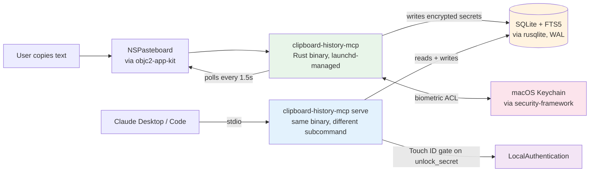

# clipboard-history-mcp v3 — Rust port design spec

**Status:** Draft
**Date:** 2026-05-05
**Author:** Dmytro Khomenko + Claude
**Topic:** Port v2 (Node.js) to a single Rust binary, ship as MCPB

---

## 1. Why a Rust port

v2 ships as a Node.js project (~91 transitive npm deps + a Swift helper + `bin/clipboard-history-mcp`). It works, but the artifact is awkward to distribute and has three real problems the language change actually solves:

1. **`security` CLI argv exposure.** v2 writes the AES master key to Keychain via `spawnSync('security', ['add-generic-password', '-w', base64Key, ...])`. The base64-encoded 32-byte key is briefly visible in `ps aux`. The reviewer flagged this as critical. Rust + `security-framework` + `SecAccessControl` writes through the Security.framework C ABI directly — argv stays clean.

2. **Touch ID not wired (v2 Phase 1.5).** v2 left biometric gate as future work because integrating `LocalAuthentication.framework` from Node would mean shipping yet another Swift helper. In Rust, `objc2-local-authentication` exposes `LAContext.evaluatePolicy_localizedReason_reply:` directly. Touch ID lands in v3 alongside the rest.

3. **Distribution friction.** Today users need Node 20+, `npm install`, and a Swift toolchain to compile `bin/pasteboard-types`. A statically-linked Rust binary plus an MCPB manifest is one drag-and-drop into Claude Desktop. Power users who prefer CLI get a Homebrew tap.

Secondary wins: ~10× cold-start, no GC pauses, smaller memory footprint, single-file installation, type-safe pasteboard / Keychain code paths, no Swift helper to maintain.

The product is **identical to v2**. The 15 MCP tools, the SQLite schema, the gitleaks rule catalog, the launchd lifecycle, the threat model — all unchanged. v3 changes the implementation, not the design.

---

## 2. Reference

[v2 design spec](2026-05-05-clipboard-history-mcp-v2-design.md) is canonical for: data model, capture flow, type detection rules, secret-handling threat model, MCP tool surface, CLI surface, configuration, project structure conventions.

This document only captures **deltas vs v2**.

---

## 3. Architecture (deltas only)



Key change: **one binary, multiple subcommands.** `clipboard-history-mcp daemon`, `clipboard-history-mcp serve` (the MCP stdio server), `clipboard-history-mcp install`, etc. The MCPB manifest invokes `clipboard-history-mcp serve`. The launchd plist invokes `clipboard-history-mcp daemon`. No separate Swift helper — `objc2-app-kit` enumerates `NSPasteboard.types` directly.

---

## 4. Crate selection

Bound by: maintained 2026, MIT/Apache-compatible, lightweight where possible, plays nicely with stable Rust 1.95+ on macOS.

```toml
[dependencies]
rmcp                       = { version = "1.6", features = ["server", "macros", "transport-io"] }
tokio                      = { version = "1.52", features = ["full"] }

# macOS frameworks
objc2                      = "0.6"
objc2-app-kit              = { version = "0.3", features = ["NSPasteboard", "NSWorkspace", "NSRunningApplication"] }
objc2-foundation           = "0.3"
objc2-local-authentication = "0.3"
security-framework         = { version = "3.7", features = ["OSX_10_15"] }
security-framework-sys     = "2.12"
accessibility              = "0.1"

# Storage & crypto
rusqlite                   = { version = "0.39", features = ["bundled"] }
aes-gcm                    = "0.10"

# Serialization / config
serde                      = { version = "1", features = ["derive"] }
serde_json                 = "1"
toml                       = "1.1"

# CLI & logging
clap                       = { version = "4.6", features = ["derive"] }
tracing                    = "0.1"
tracing-subscriber         = { version = "0.3", features = ["env-filter"] }

# Utilities
anyhow                     = "1"
thiserror                  = "2"
schemars                   = "0.9"
sha2                       = "0.10"
uuid                       = { version = "1", features = ["v4"] }
```

**Code language detection:** No maintained Rust port of `flourite` exists. Roll our own ~200-line keyword scorer (shebang detection + token-frequency table for Python/JS/TS/Rust/Go/Java/C/C++/SQL/HTML/CSS/YAML/Markdown/shell). This is what the v2 review flagged as adequate; `flourite` itself is heuristic-only.

**TOML parsing:** `toml` 1.1 (serde-based, Apache/MIT) replaces `@iarna/toml`. Same gitleaks ruleset (252 patterns) loads on startup.

**No async runtime in capture path.** `rmcp` requires `tokio`, so the MCP binary needs it. Daemon capture is sync (`std::thread::sleep` + blocking polls). This avoids forcing tokio's overhead on the watcher hot path.

---

## 5. File structure

```
clipboard-history-mcp/
├── Cargo.toml
├── Cargo.lock
├── src/
│   ├── main.rs                 # binary entry, clap subcommand dispatch
│   ├── cli/
│   │   ├── mod.rs
│   │   ├── install.rs          # write launchd plist, load via launchctl
│   │   ├── uninstall.rs
│   │   ├── status.rs
│   │   ├── doctor.rs
│   │   ├── vault.rs
│   │   └── migrate_v2.rs       # read v2 SQLite + replay into v3 schema
│   ├── daemon/
│   │   ├── mod.rs
│   │   ├── watcher.rs          # poll loop
│   │   └── context.rs          # frontmost app + window title (objc2 + accessibility)
│   ├── mcp/
│   │   ├── mod.rs              # rmcp server entry
│   │   └── tools.rs            # all 15 tools as one impl block with #[tool] macros
│   ├── core/
│   │   ├── mod.rs
│   │   ├── store.rs            # rusqlite wrapper + dedup + FTS search
│   │   ├── db.rs               # schema migrations
│   │   ├── crypto.rs           # AES-GCM + Keychain via security-framework
│   │   ├── types.rs            # type classifier
│   │   ├── secrets.rs          # gitleaks rules loader + Luhn + JWT
│   │   ├── pasteboard.rs       # NSPasteboard read/write/types via objc2
│   │   └── biometry.rs         # LAContext wrapper for Touch ID
│   └── lib.rs                  # re-exports for testing
├── vendor/
│   └── gitleaks.toml           # carried over from v2
├── tests/
│   ├── store.rs
│   ├── types.rs
│   ├── secrets.rs
│   ├── crypto.rs
│   └── e2e.rs
├── mcpb/
│   ├── manifest.json           # MCPB manifest
│   └── icon.png                # optional, can come later
├── scripts/
│   ├── launchd.plist.template
│   ├── pack-mcpb.sh            # cargo build --release → strip → mcpb pack
│   └── refresh-gitleaks.sh
├── .github/workflows/
│   ├── ci.yml                  # cargo test on macos-13/14, cargo clippy, cargo fmt
│   └── release.yml             # tag-triggered: build, sign, notarize, attach .mcpb
├── README.md
├── CHANGELOG.md
├── CONTRIBUTING.md
├── LICENSE                     # MIT (carry over)
└── docs/superpowers/...        # carry over from v2 + this spec
```

---

## 6. MCPB packaging

`mcpb/manifest.json`:

```json
{
  "manifest_version": "0.4",
  "name": "clipboard-history-mcp",
  "version": "0.3.0-alpha.0",
  "description": "Type-aware, secret-safe macOS clipboard history exposed to Claude via MCP.",
  "author": { "name": "Dmytro Khomenko" },
  "server": {
    "type": "binary",
    "entry_point": "server/clipboard-history-mcp",
    "mcp_config": {
      "command": "${__dirname}/server/clipboard-history-mcp",
      "args": ["serve"],
      "env": {}
    }
  },
  "compatibility": {
    "claude_desktop": ">=1.0.0",
    "platforms": ["darwin"]
  }
}
```

Build pipeline:

1. `cargo build --release --target aarch64-apple-darwin`  
2. `cargo build --release --target x86_64-apple-darwin`  
3. `lipo -create -output clipboard-history-mcp <both>` (universal binary)
4. `strip clipboard-history-mcp` (drop ~5 MB of debug info)
5. `codesign --deep -s "$DEV_ID" clipboard-history-mcp` (skip for ad-hoc test builds)
6. `cp clipboard-history-mcp mcpb/server/`
7. `npx @anthropic-ai/mcpb pack mcpb/ -o clipboard-history-mcp-v0.3.0-alpha.0.mcpb`

**Signing:** v3 ships with ad-hoc signing for now. Apple Developer ID + notarization is a v0.3.x improvement, not a v0.3.0 blocker. Users who hit Gatekeeper can run `xattr -d com.apple.quarantine clipboard-history-mcp.mcpb` (documented in README).

---

## 7. Migration from v2

`clipboard-history-mcp migrate-v2` reads `~/Library/Application Support/clipboard-history-mcp/history.db` (v2 path), opens v3 DB at the same path (schema is identical — same `clips`, `kinds`, `tags`, `secrets`, `clips_fts`, `meta` tables), and walks rows. Crucially: **the SQLite schema is byte-identical to v2.** v3 can open a v2 database file directly. The migrate command is mostly a no-op with a sanity-check pass — its real purpose is to re-encrypt secrets if the master key was regenerated, but in normal cases the same Keychain entry serves both v2 and v3.

Only the AES master key store changes location: v2 stored it under Keychain service `clipboard-history-mcp` / account `master-key-v1`. v3 reads the same entry. No re-encryption needed unless the user runs `migrate-v2 --re-encrypt`.

---

## 8. Touch ID (closing v2 Phase 1.5)

`unlock_secret` tool gains a Touch ID gate:

```rust
let auth_ctx = LAContext::new();
auth_ctx.set_localized_reason("Reveal stored API key");
auth_ctx.evaluate_policy(LAPolicy::DeviceOwnerAuthenticationWithBiometrics, |ok, err| {
    if ok {
        // proceed with decrypt + return
    } else {
        // return { error: "biometric authentication failed" }
    }
});
```

Cached for 5 minutes per session via a global `RwLock<Option<Instant>>`. Falls back to passcode if biometry is unavailable.

Master key Keychain entry gains a `SecAccessControl` with `kSecAccessControlBiometryCurrentSet` so the OS-level prompt fires automatically when the daemon and MCP read the key for the first time per session. After that, both processes have it cached.

---

## 9. Testing

`cargo test` on `macos-13` + `macos-14` GitHub runners. The capture-path integration tests (`pbcopy` smoke test) move into `#[ignore]`-by-default tests because GitHub macOS runners don't have Accessibility permissions. CI runs unit + a "no-pbcopy" subset. Local devs run `cargo test -- --ignored` for full coverage.

E2E test: copy a fake OpenAI key to clipboard via `pbcopy`, wait for the watcher tick, assert the row exists with `text = NULL` and `unlock_secret` round-trips correctly. Same shape as v2 e2e test.

---

## 10. CI/CD changes

`.github/workflows/ci.yml`:
- macos-13 + macos-14 matrix
- `cargo fmt --check`, `cargo clippy -- -D warnings`, `cargo test`
- No npm at all — Node only used at release time for `mcpb` CLI

`.github/workflows/release.yml` (tag-triggered):
- Builds universal binary
- Strips, ad-hoc signs
- Runs `npx @anthropic-ai/mcpb pack`
- Uploads `.mcpb` + raw binary as release assets
- Updates Homebrew tap (separate repo, optional)

---

## 11. Open questions / risks

1. **`rmcp` 1.6 stability.** Officially-supported but young. The `#[tool_router]` macro is the supported path; we use it as documented. If we hit a serialization edge case, we can drop one level to `ServerHandler` impl manually.

2. **Touch ID on devices without biometry.** Mac mini, older Macs without Touch ID. `LAContext.canEvaluatePolicy(.deviceOwnerAuthentication)` (passcode fallback) handles this. We surface a `requires_passcode: true` flag in the unlock-tool response so Claude knows.

3. **objc2 + Send/Sync.** Pasteboard / NSWorkspace types are `!Send`. The watcher loop must do all NSPasteboard work on a single thread. Pinning the watcher thread via `std::thread::Builder` is straightforward.

4. **Universal binary size.** ARM64 + x86_64 doubles the binary size; expect ~10 MB after `strip`. Acceptable for an MCPB.

5. **Code-signing for Claude Desktop installer.** Ad-hoc signing should work, but if Claude Desktop refuses unsigned MCPBs in the future we'll need a Developer ID. Track in v0.3.x.

6. **Migrating an in-flight v2 daemon.** If a v2 daemon is running when user installs v3, the launchd labels don't conflict (`me.kz.clipboard-history` for both — uninstall v2 first via `clipboard-history uninstall` then install v3).

---

## 12. Out of scope for v3

- Linux / Windows support (macOS-only stays through v3, cross-platform is v0.4)
- Image / file clip capture (text only, schema already supports extension)
- iCloud / Git / cloud sync
- GUI
- Semantic embedding search

---

## 13. Open-source-or-not checklist (carryover from v2)

- [ ] No personal data in test fixtures
- [ ] No hardcoded paths from `/Users/stock/...`
- [ ] No real API keys, no real emails
- [ ] `Cargo.lock` committed (binary project)
- [ ] LICENSE / CHANGELOG / CONTRIBUTING updated
- [ ] README has install instructions for both MCPB and Homebrew
- [ ] CI workflows tested on a fresh macos runner
